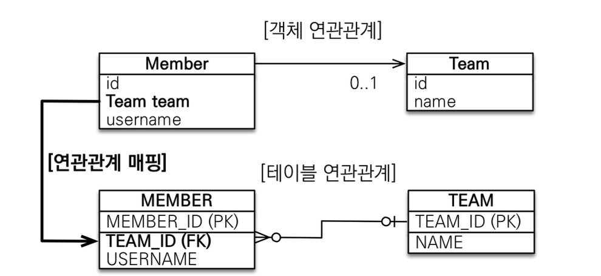
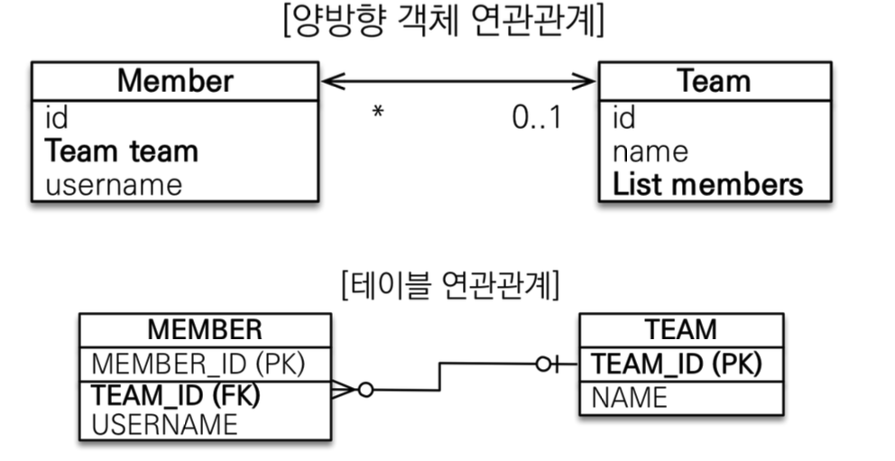
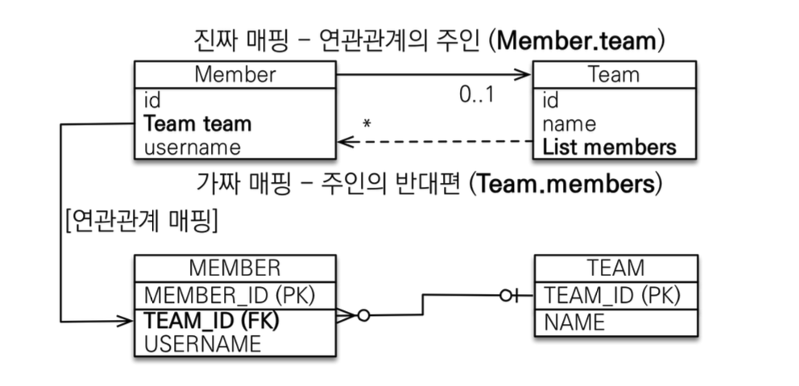

# 단방향 연관관계


- 회원, 팀 테이블 설계
  - N:1관계

### 객체설계를 테이블 설계에 맞춘 방식

```java
@Entity
public class Member {
    @Id
    @GeneratedValue(strategy = GenerationType.AUTO)
    @Column(name = "member_id")
    private Long id;
    
    @Column(name = "username")
    private String name;
    
    @Column(name = "team_id")
    private String teamId;
    ...
}

@Entity
public class Team {
    @Id
    @GeneratedValue
    @Column(name = "team_id")
    private Long id;
    
    private String name;
    ...
}
```

- 이러한 설계를 할 경우 참조관계가 없기 때문에 연관관계 참조 불가능
- member의 team의 이름을 찾고싶은 경우, member를 DB에서 찾고 member의 team id를 통해 DB에서 team을 찾아야함

1. 엔티티 생성
```java
    Team team = new Team();
    team.setName("TeamA");
    em.persist(team);
    
    Member member = new Member();
    member.setName("member1");
    member.setTeamId(team.getId());
    
    em.persist(member);
```

2. 엔티티 연관관계 조회
```java
    Member findMember = em.find(Member.class, member.getId());
    Team findTeam = em.find(Team.class, member.getTeamId());
```

3. 연관관계 수정
```java
    Team team100 = new Team();
    team.setName("Team100");
    
    em.persist(team100);
    
    findMember.setTeamId(team100.getId());
```

### 연관관계를 고려한 객체설계

```java
@Entity
public class Member {
    @Id
    @GeneratedValue(strategy = GenerationType.AUTO)
    @Column(name = "member_id")
    private Long id;
    
    @Column(name = "username")
    private String name;
    
    @ManyToOne
    @JoinColumn(name = "team_id")
    private Team team;

    ...
}
```

- 1:N관계에서 N인 쪽(회원)에서 1인 쪽(팀)의 PK를 FK로 설정
  - 테이블 개념
- 1:N관계에서 N인 쪽(회원)에서 필드로 1인 쪽(팀)의 객체사용
  - 객체 개념
- `@JoinColumn` : 연관관계 설정할 엔티티 설정, 해당 엔티티에서 필드값 매핑
- `@ManyToOne` : 관계설정

<br/>

1. 엔티티 등록
```java
Team team = new Team();
team.setName("TeamA");
em.persist(team);

Member member = new Member();
member.setUsername("member1");
member.setTeam(team); // 연관관계 생성
em.persist(member);
```

2. 엔티티 연관관계 조회
```java
    Member findMember = em.find(Member.class, member.getId());
    // 참조를 통한 연관관계 조회    
    Team findTeam = findMember.getTeam();
```

3. 엔티티 연관관계 수정
```java
    Team team100 = new Team();
    team.setName("Team100");
    
    em.persist(team100);
    
    findMember.setTeam(team100);
```

# 양방향 연관관계와 연관관계의 주인



### 테이블 연관관계

```sql
select *
from member m
    join team t on m.team_id = t.id;

select *
from team t
    join member m on t.team_id = m.id;
```
- 하나의 외래키를 통해 두 테이블을 양방향으로 참조 가능

### 객체 연관관계

```java
@Entity
public class Member {
    @Id
    @GeneratedValue(strategy = GenerationType.AUTO)
    @Column(name = "member_id")
    private Long id;
    
    @Column(name = "username")
    private String name;
    
    @Column(name = "team_id")
    private String teamId;
    ...
}

@Entity
public class Team {
    @Id
    @GeneratedValue
    @Column(name = "team_id")
    private Long id;
    
    @OneToMany(mappedBy="team") // 연관관계 주인 설정
    private List<Member> members = new ArrayList<Member>();
    ...
}
```

- 두 개의 단방향 간선 필요
  - 멤버(N) -> 팀(1) (멤버의 팀 필드를 통해)
  - 팀(1) -> 멤버(N) (팀의 리스트를 통해)
- 단방향만으로 연관관계를 설정할 수 있지만, 수월한 탐색으 위해 양방향 관계를 맺은 것

## 양방향 매핑 규칙



- 외래키가 있는 엔티티가 주인
- **주인이 아닌 쪽**
  - `mappedBy` 속성O
  - 등록, 수정 X, 조회만 가능
- **주인**
  - `mappedBy` 속성X
  - 연관관계의 주인만이 외래키를 관리(등록, 수정)
  - 외래키가 있는 쪽에 주인 설정

### 양방향 매핑시 주의점

- 연관관계의 주인에 값을 입력

```java
Team team = new Team();
team.setName("TeamA");
em.persist(team);

Member member = new Member();
member.setName("member1");

//역방향(주인이 아닌 방향)만 연관관계 설정
team.getMembers().add(member);
em.persist(member);

// Member
// |    id  |   name    |   team_id |
// |    1   |   memberA |   null    |
```
```java
Team team = new Team();
team.setName("TeamA");
em.persist(team);

Member member = new Member();
member.setName("member1");

//주인에 연관관계 설정
member.setTeam(team);
em.persist(member);

// Member
// |    id  |   name    |   team_id |
// |    1   |   memberA |   2   |
```

- 연관관계 조회시 
  - 영속성 컨텍스트의 1차캐시 고려
  - 엔티티 생성 후 조회해오면 커밋하기 전이기 때문에 1차 캐시에서 엔티티를 불러옴
  - 직접 연관관계를 설정하지 않은 경우에는 team의 members에 새로 생성한 엔티티가 반영되지 않음
  - 해결방법
    1. flush(), clear()를 통해 DB 반영한 1차캐시 채우기
    ```java
    Team team = new Team();
    team.setName("TeamA");
    em.persist(team);

    Member member = new Member();
    member.setName("member1");
    member.setTeam(team);
    em.persist(member);

    em.flush();
    em.clear();

    Member findMember = em.find(Member.class, member.getId());
    List<Member> members = findMember.getTeam().getMembers();

    for (Member m : members) {
        System.out.println("member = " + m.getName());
    }
    ```
    2. 순수한 객체 상태를 위해 양방향 모두에 엔티티 넣어주기 -> 1차캐시에서도 조회가능
    ```java
    Team team = new Team();
    team.setName("TeamA");

    Member member = new Member();
    member.setName("member1");
    member.setTeam(team);
    em.persist(member);

    team.getMembers.add(member);
    em.persist(team);
    
    Member findMember = em.find(Member.class, member.getId());
    List<Member> members = findMember.getTeam().getMembers();

    for (Member m : members) {
    System.out.println("member = " + m.getName());
    }
    ```
      - 실수를 방지하기위해 **연관관계 편의 메소드 생성** 권장
    ```java
    // Member
    public void changeTeam(Team team) {
        this.team = team;
        team.getMembers().add(this);
    }
    
    // Main
    
    // member -> team 연관관계 설정
    // 해당 코드 실행시 반대편의 연관관계도 (컬렉션에 add) 자동설정
    member.changeTeam(team1);
    ``` 

- 무한루프
  - toString, lombok : 연관관계가 있는 하나의 엔티티에만 구현하기 
  - JSON : 엔티티가 아닌 DTO로 반환하기
  

