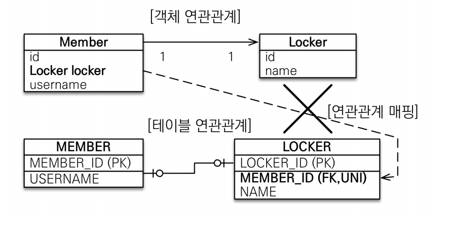
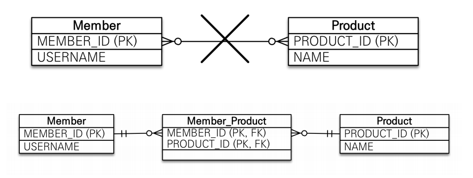

# 다양한 연관관계 매핑

## 고려사항 3가지

### 다중성

- 다대일 : `@ManyToOne`
- 일대다 : `@OneToMany`
- 일대일 : `@OneToOne`
- 다대다 : `@ManyToMany`

### 단방향, 양방향
#### 테이블 관점

- 사실상 테이블은 방향이라는 것이 없음
- 외래키 하나로 양쪽 조인 가능

#### 객체 관점

- 참조용 필드가 있는 쪽으로만 참조 가능
- 양쪽이 참조할 경우 양방향, 한쪽만 참조할 경우 단방향

### 연관관계의 주인

- 두 테이블의 연관관계는 외래키를 통해 맺을 수 있음
- 양방향(양쪽에서 참조)일 경우, 외래키관리 테이블을 지정해야함
- `외래키가 있는 엔티티`가 연관관계의 주인(추가, 수정, 삭제 가능)
- 주인이 아닌 엔티티는 조회만 가능(`mappedby`로 표시)

# 다대일

### 단방향 [N:1]


```java
@ManyToOne
@JoinColumn(name="team_id")
private Team team;
```

### 양방향 [N:1, 1:N]


- 외래키가 있는 쪽이 연관관계의 주인(항상 '다'쪽이 주인)
- 두 엔티티 모두 서로를 참조해야함

```java
// Member

@ManyToOne
@JoinColumn(name="team_id")
private Team team;

// 연관관계 편의 메소드
public void setTeam(Team team) {
    this.team = team;
    
    if(!team.getMembers().contains(this)) {
        team.getMembers().add(this);
    }
}

```
```java
//Team

@OneToMany(mappedby="team") // 연관관계의 주인 설정
private List<Member> members = new ArrayList<Member>();

// 연관관계 편의 메소드
public void addMember(Member member) {
    this.members.add(member);
    
    if (member.getTeam() != this) {
        member.setTeam(this);
    }
}
```

# 일대다

`다대일관계 권장`
- 엔티티를 하나 이상 참조하기 때문에 자바 컬렉션 사용
> **List** <br/>
> 순서O, 중복O <br/>
> @Orderby를 통해 정렬 가능<br/>
> add()할 경우, insert쿼리 발생<br/>

> **Set**<br/>
> 순서X, 중복X <br/>
> @Orderby를 통해 정렬할 경우 해쉬값으로 정렬되어 의도와 달리 정렬될 수 있음<br/>

### 단방향[1:N]


- 1인 쪽이 연관관계의 주인
- 항상 N쪽에 외래키가 있음
- `@JoinColumn`을 꼭 사용해야함. 사용하지 않을 경우 조인 테이블 방식 사용(중간 테이블 삽입)
  >**조인 테이블 전략**<br/>
  >A테이블과 B테이블이 연결된 매핑 테이블 생성<br/>
  >**@JoinColumn생략시**<br/>
  > @OneToMany 조인테이블전략 적용O<br/>
  > @ManyToOne은 조인테이블전략 적용X
- 1인쪽에서 수정이 생기면 DB에서 N쪽으로 쿼리가 나감
  >외래키가 다른 테이블에 있기 때문에 수정되면 그 테이블도 수정해야함<br/>
  >연관관계 처리를 위해 update문 추가 실행
```java
// Team
@OneToMany
@JoinColumn(name = "team_id") // MEMEBER 테이블의 TEAM_ID (FK)
private List<Member> members = new ArrayList<Member>();
```

### 양방향[1:N, N:1]

- 공식적으로 이런 테이블은 없음
- 외래키는 항상 N쪽에 있기 때문에 `@ManyToOne`속성에는 mappedby가 없음
- 양방향 매핑을 위해서는 @JoinColumn속성에 insertable, updatable을 false로 설정

```java
// Member
@ManyToOne
@JoinColumn(name = "team_id", insertable = false, updatable = false) // 연관관계의 주인이 아님을 표시
private Team team;
```
```java
//Team
@OneToMany // mappedby사용X
@JoinColumn(name = "team_id") // 연관관계의 주인
List<Member> members = new ArrayList<>();
```

# 일대일

## 외래키의 위치

- 외래키에 데이터베이스 `@JoinColumn(unique=true)` 추가

### 주 테이블에 외래키

- 주로 사용하는 테이블
- 주 테이블에 외래키를 두고 대상 테이블 참조
- 주 테이블만으로 대상 테이블과의 연관관계 확인 가능
- 값이 없을 경우 외래키에 null허용
- 객체지향 개발자 선호

#### 단방향 [1(주):1]


```java
//Member
@OneTo0ne
@JoinColunm (name = "locker_id")
private Locker locker;
```

#### 양방향 [1:(주):1]


```java
//Member
@OneTo0ne
@JoinColunm (name = "locker_id")
private Locker locker;
```
```java
//Locker
@OneToOne(mappedBy = "locker")
private Member member;
```

### 대상 테이블에 외래키

- 양방향 구조만 지원
- 일대일에서 일대다 관계로 변경할 때 테이블 구조 유지
- 프록시 기능의 한계로 지연 로딩으로 설정해도 항상 즉시 로딩
- 데이터베이스 개발자 선호

#### 단방향 [1(대상):1]



- JPA지원X

#### 양방향 [1(대상):1]


```java
//Member
@OneTo0ne(mappedby="member")
private Locker locker;
```
```java
//Locker
@OneToOne
@JoinColunm (name = "member_id")
private Member member;
```

# 다대다

`실무에서 사용X`



- 관계형 데이터베이스는 정규화된 테이블 2개로 N:N관계를 표현X
- 중간에 연결 테이블을 통해 1:N, N:1관계를 맺어야함

## 다대다 한계 극복


- 연결 테이블을 엔티티로 승격

```java
// Member와 Product의 연결테이블 Order

@Id @GeneratedValue    
private String id;

// N:N -> 1:N / N:1 
@ManyToOne
@JoinColumn(name = "member_id")
private Member member;

@ManyToOne
@JoinColumn(name = "product_id")
private Product product;

// 추가정보도 연결테이블에 저장 가능
private int orderAmount;
private LocalDateTime orderDate;
```
