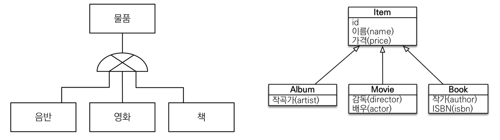
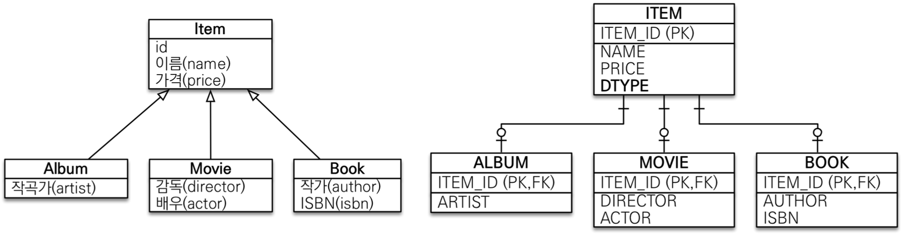
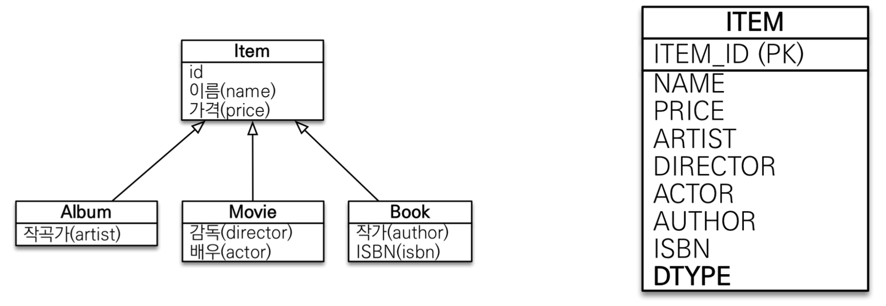
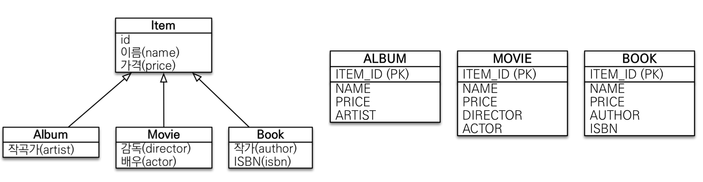
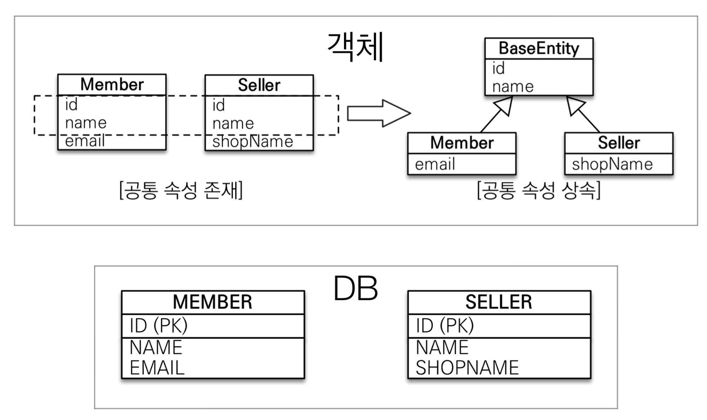

# 고급매핑
## 상속관계매핑



- 객체의 상속구조와 데이터베이스의 슈퍼타입, 서브타입 관계 매핑

- **각각의 테이블로 변환** : 슈퍼타입, 서브타입 테이블 생성 후 조회 시 조인 사용
- **단일 테이블로 변환** : 여러 테이블을 하나의 테이블에 통합
- **서브타입 테이블로 변환** : 서브 타입마다 각각의 테이블 생성

## 주요 어노테이션

- `@Inheritance(strategy = InheritanceType.XXX)`
  - JOINED : 조인전략
  - SINGLE_TABLE : 단일 테이블 전략
  - TABLE_PER_CLASS : 구현 클래스마다 테이블 전략
- `@DiscriminatorColumn(name = “DTYPE”)`
- `@DiscriminatorValue(”XXX”)`

## 조인 전략



- 자식 테이블이 부모 테이블의 기본키를 외래키로 사용하는 전략
- 테이블 구분하는 컬럼을 추가해야함
- 장점
  - 정규화된 테이블
  - 외래키 참조 무결성 제약조건 활용
  - 저장공간을 효율적으로 사용
- 단점
  - 조회할 때 조인이 많이 사용됨(성능저하 우려)
  - 복잡한 조회쿼리
  - 데이터를 등록할 경우, 부모클래스와 자식 클래스 각각에 insert문 실행

`조인이 많아도 조건이 잘 걸려있을 경우 성능 하락X, 효율적으로 저장공간이 관리`

```java
@Entity
@Inheritance(strategy = InheritanceType.JOINED) // 상속 매핑 전략 설정(부모 클래스에 선언) 
@DiscriminatorColumn(name = "DTYPE") // 부모 클래스에 구분 컬럼 지정 
public abstract class Item {

	@Id @GeneratedValue
	@Column(name = "ITEM_ID")
	private Long id;

	private String name; 
	private int price; 
	...
}

@Entity
@DiscriminatorValue("A") // 구분 컬럼 값 지정
public class Album extends Item {
  private String artist;
	...
}

@Entity
@DiscriminatorValue("M") // 구분 컬럼 값 지정
public class Movie extends Item {
  private String director; 
  private String actor; 
	...
}
```

## 단일 테이블 전략(default)



- 반드시 구분컬럼 설정, 구분 컬럼(DTYPE)으로 자식 테이블 구분
- 장점
  - 조인을 사용하지 않아 빠른 조회 성능
  - 단순한 조회 쿼리
- 단점
  - 다른 자식 엔티티의 컬럼은 null허용
  - 하나의 테이블에 통합하기 때문에 테이블이 커질 수 있음(성능저하 우려)

```java
// 조인 전략과 동일하고 전략 설정만 다르게 해줌
@Inheritance(strategy = InheritanceType.SINGLE_TABLE)
```

## 구현 클래스마다 테이블 전략



`추천하지 않는 전략`
- 구분 컬럼 사용X
- 장점
  - 서브 타입 구분 처리시 효과적
  - not null 제약조건 사용가능
- 단점
  - 여러 자식 테이블을 함께 조회시 성능이 느림(모두 join하여 사용)
  - 자식 테이블을 통합하여 조회 어려움

## @MappedSuperclass



- 공통 매핑 정보가 필요할 경우 사용
- 상속관계 매핑X
- 부모클래스(공통 클래스)
  - 엔티티가 아님, 따라서 테이블 매핑X
  - 자식 클래스에 매핑 정보만 제공
  - 부모 타입으로 DB 조회, 검색, JPQL사용X
  - 자식클래스를 사용하기 때문에 `추상클래스`

`@Entity클래스는 엔티티나 @MappedSuperclass로 지정한 클래스만 상속 가능`

```java
@MappedSuperclass
public abstract class BaseEntity {
  @Id @GeneratedValue
  private Long id;
  private String name;
  ...
}

@Entity
public class Member extends BaseEntity {

  private String email;
  ...
}

@Entity
public class Seller extends BaseEntity {

  private String shopName;
  ...
}
```