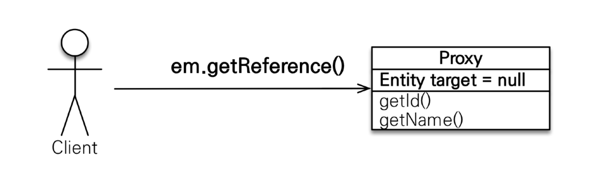
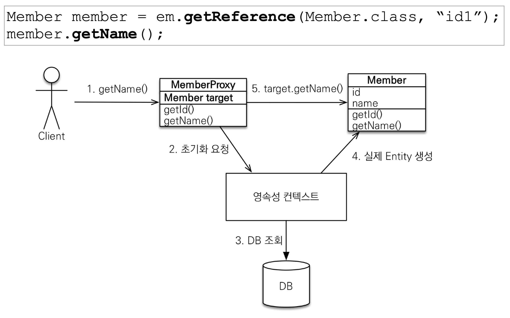
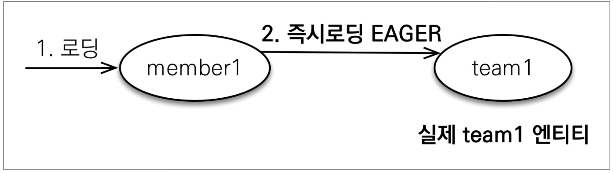
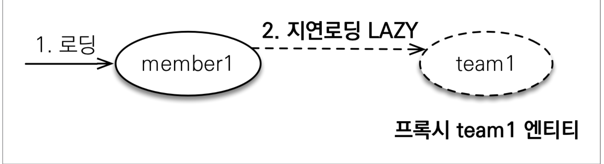

# 프록시와 연관관계
## 프록시

- 하나의 엔티티를 DB에서 조회해올때 연관관계에있는 모든 엔티티를 가져올 것인가? 에 대한 고민에서 시작
- 로직에따라 연관관계의 엔티티가 필요할때가 있고 없을때가 있음
- 그렇다면 항상 모든 연관관계의 엔티티를 같이 조회해와야할까?
- 엔티티가 실제 사용될때 DB에서 가져오는 방법인 `지연로딩`사용
- 조회를 지연시키기 위해서는 가짜객체가 필요하고 그것을 `프록시`라 칭함

### 프록시 기초

- `em.find()` : DB를 통해서 실제 엔티티 객체 조회
    ```java
    Member member = em.find(Member.class, "member1");
    ```
- `em.getReference()` : DB 조회를 미루는 가짜(프록시)엔티티 객체 조회
  
    ```java
    Member member = em.getReference(Member.class, "member1");
    ```
    - 프록시는 실제 객체에 대한 참조를 보관
    - 프록시 객체의 메소드 호출시 실제 객체를 DB에서 찾아와서 실제 객체를 참조
    - 이를 `프록시 객체 초기화`
  
### 프록시 특징


- 실제 클래스를 상속
- 프록시 객체 초기화시 프록시 객체가 실제 엔티티로 바뀌는 것X
  - 프록시 객체를 통해 실제 객체에 접근할 수 있음
- 프록시 객체는 원본 엔티티를 상속 받는 객체이기때문에 **타입 체크시 주의**
- 조회하고자하는 엔티티가 영속컨텍스트에 있을 경우, `getReference()`를 호출해도 프록시 객체X, 실제 엔티티 반환
- 프록시 초기화는 영속성 컨텍스트 통해 진행됨
- `준영속 상태의 프록시`는 초기화X
  - `org.hibernate.LazyInitializationException` 발생
- 프록시 객체는 식별자(PK)를 가지고 있기 때문에 식별자를 조회시 초기화X
```java
Team team = em.getReference(Team.class, "team1"); // 식별자 보관
team.getId(); // 초기화되지 않음
```

## 즉시로딩과 지연로딩

- **즉시로딩** : `@ManyToOne(fetch = FetchType.EAGER)`
- **지연로딩** : `@ManyToOne(getch = FetchType.LAZY)`

### 즉시로딩


- 즉시로딩을 할경우 join문을 통해 연관관계의 엔티티를 조회
- 외래키(FK)로 null을 허용할 경우
  - 외부조인 사용시 연관관계가 아닌 엔티티가 조회될 수 있음
  - 내부 조인이 성능과 최적화에 유리
- 내부조인을 사용하기 위해서는 외래키(FK)에 NOT NULL 제약 조건 설정해야함
  - `@JoinColumn(name = "TEAM_ID", nullable = false)`
  - `@ManyToOne(fetch = FetchType.EAGER, optional = false)`
> JPA는 선택적 관계일 경우 외부조인, 필수 관계일 경우 내부 조인 사용

### 지연로딩 - 실무에서는 무조건 지연로딩사용!!!!



### JPA 기본 fetch전략

- `@ManyToOne`, `@OneToOne` : 즉시 로딩(FetchType.EAGER)
- `@OneToMany`, `@ManyToMany` : 지연 로딩(FetchType.LAZY)

## 영속성 전이: CASCADE

- 특정 엔티티를 영속 상태 시 연관관계의 엔티티도 함께 영속상태로 만들고 싶을때 사용
  - 부모 엔티티를 저장할 떄 자식 엔티티도 함께 저장
- 영속성 전이 설정X
```java
  Parent parent = new Parent();

  Child child1 = new Child();
  Child child2 = new Child();

  parent.addChild(child1);
  parent.addChild(child2);

// 연관관계인 엔티티를 각각 영속화 해야함
  em.persist(child1);
  em.persist(child2);
  em.persist(parent);
```
- 영속성 전이 설정O
```java
// parent
    @OneToMany(mappedBy = "parent", cascade = CascadeType.PERSIST)
    private List<Child> children = new ArrayList<Child>();
```
```java
  Parent parent = new Parent();

  Child child1 = new Child();
  Child child2 = new Child();

  parent.addChild(child1);
  parent.addChild(child2);

// 가장 상위의 엔티티만 영속화할 경우 
// 연관관계인 엔티티도 영속화됨
  em.persist(parent);
```
> 영속성 전이는 연관관계 매핑과 연관X<br/>
> 단지 엔티티를 영속화할때 연관된 엔티티도 같이 영속화하는 편리함을 제공할 뿐임

### CASCADE의 종류

```java
public enum CascadeType {
    ALL, //모두 적용
    PERSIST, //영속
    MERGE, //병합
    REMOVE, //삭제
    REFRESH, //REFRESH
    DETACH //DETACH
}
```
- `CascadeType.PERSIST`, `CascadeType.REMOVE`는 `em.persist()`, `em.remove()` 호출 시 전이X
- `flush()` 호출시 전이 발생

## 고아 객체

- `고아 객체 제거` : 부모 엔티티와 연관관계가 끊어진 자식 엔티티를 자동 삭제
```java
// Parent 
  @OneToMany(mappedBy = "parent", orphanRemoval = true)
  private List<Child> children = new ArrayList<Child>();
```
- 참조가 제거된 엔티티를 삭제하기 때문에 다수의 연관관계인 엔티티일 경우 문제가 발생할 수 있음
  - 두 부모가 있는데 하나의 부모(1)가 사라졌다고해서 이 자식을 삭제하면 다른 부모(2)에서는 자식을 찾을 수 없게됨
- 이런 이유로 orphanRemovel은 `@OneToOne`, `@OneToMany`에만 사용

## 영속성 전이 + 고아객체, 생명주기

`CascadeType.ALL` + `orphanRemovel=true`
- 일반적인 엔티티의 생명주기
  - `EntityManager.persist()`를 통해 영속화
  - `EntityManager.remove()`를 통해 삭제
- 두 옵션을 모두 활성화하면 부모 엔티티를 통해서 자식의 생명주기를 관리할 수 있음
- 도메인 주도 설계(DDD)의 Aggregate Root개념 구현시 유용
