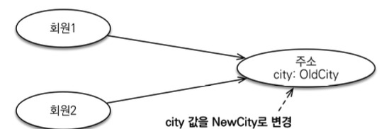
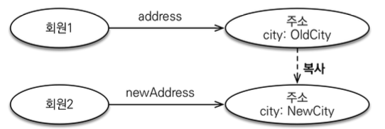
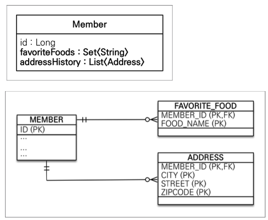

# JPA의 데이터 타입 분류

```java
@Entity
public class Member { // 엔티티 타입
    @Id
    @GeneratedValue
    private Long id; // 기본값 타입
    
    @Embedded
    private Address address; // 임베디드 타입
    
    private List<Food> favoriteFood = new ArrayList<>(); // 컬렉션 값 타입
    // 값 타입
}
```
- 엔티티 타입
- 값 타입
  - 기본값 타입
    - 자바 기본 타입(int, double)
    - 래퍼 클래스(Integer, Long)
    - String
  - 임베디드 타입
  - 컬렉션 값 타입

# 엔티티 타입

- @Entity로 정의하는 객체
- 데이터가 변해도 식별자로 지속해서 추적 가능
- 회원 엔티티의 키나 나이값을 변경해도 식별자로 인식 가능

# 값 타입

- int, Integer, String처럼 단순히 값으로 사용하는 자바 기본 타입이나 객체
- 식별자가 없고 값만 있으므로 변경시 추적 불가
- 숫자 100을 200으로 변경하면 완전히 다른 값으로 대체

## 기본값 타입

- 생명주기를 엔티티의 의존
  - 회원 삭제시 id, name 등과 같은 필드값 함께 삭제
- 값 타입은 공유X
  - 회원(1) 이름 변경시 같은 이름의 회원(2)의 이름이 변경되면 안됨
> 자바의 기본 타입은 공유되지 않음<br/>
> 기본 타입은 항상 값을 복사하여 사용하기 때문<br/>
> 래퍼클래스나 String같은 클래스는 공유 가능한 객체이지만 변경X

```java
int a = 10;
int b = a;
// a : 10, b : 10
b = 20;
// a : 10, b : 20
// primitive타입은 값을 복사하여 사용
```

## 임베디드 타입

```java
@Embeddable
public class Address{
    private String city;
    private String street;
    private String zipcode;
}
```

- 새로운 값 타입을 직접 정의 가능
- 주로 기본 값 타입을 모아서 만들어 복합 값 타입이라고도 함
- `@Embeddable` : 값 타입을 정의하는 곳에 표시
- `@Embedded` : 값 타입을 사용하는 곳에 표시
- 기본 생성자 필수
- 장점
  - 재사용
  - 높은 응집도
  - address.fullAddress()처럼 해당 값 타입만 사용하는 의미 있는 메소드 생성 가능
> 임베디드 타입을 포함한 모든 값 타입은 값 타입을 소유한 엔티티의 생명주기를 의존

### 임베디드 타입과 테이블 매핑

- 임베디드 타입은 엔티티의 값일 뿐임
- 임베디드 타입을 사용하기 전과 후에 매핑하는 테이블은 같음(DB는 변하지 않음)
- 잘 설계한 ORM 어플리케이션은 `매핑한 테이블 수보다 클래스의 수가 더 많음`
- 임베디드 타입의 값이 null이면 매핑한 컬럼 값은 모두 null

#### @AttributeOverride : 속성 재정의

- 엔티티에 같은 임베디드타입이 다수일 경우 매핑 정보를 재정의 할 수 있음
  - 집주소, 회사주소 등
- 컬럼 명이 중복되기 때문에 `@AttributeOverrides`, `@AttributeOverride`를 사용해서 컬럼명 속성 재정의
```java
@Embedded 
Address homeAddress;

@Embedded
@AttributeOverrides({
  @AttributeOverride(name="city", column=@Column(name = "COMPANY_CITY")),
  @AttributeOverride(name="street", column=@Column(name = "COMPANY_STREET")),
  @AttributeOverride (name="zipcode", column=@Column (name = "COMPANY_ZIPCODE"))
})
Address companyAddress;
```

### 값 타입 공유 참조



```java
Address address1 = new Address("old1", "street", "10000");
Address address2 = address1;
// address1 = "old1"
// address2 = "old1"

address2.setCity("new1");
// address1 = "new1"
// address2 = "new1"
```

- 임베디드 타입과 같은 값 타입을 여러 엔티티에서 공유하면 위험
- 부작용 발생
- 하나의 값을 변경하면 같은 값을 공유하는 다른 엔티티의 값도 변경됨



```java
Address address1 = new Address("old1");
Address address2 = new Address(address1.getCity())
// address1 = "old1"
// address2 = "old1"

address2.setCity("new1");
// address1 = "old1"
// address2 = "new1"
```
- 자바는 객체에 값을 대입하면 항상 참조값을 전달 
- `값타입을 공유하지않고 복사하여 사용!`

### 불변 객체

- 객체 타입을 수정할 수 없게 만들면 부작용을 원천 차단할 수 있음
- 값타입은 불변 객체로 설계
- 생성자로만 값을 설정하고 Setter생성X

## 값 타입의 비교

- 동일성(identity) 비교 : 인스턴스의 참조값 비교(`==`)
- 동등성(Equivalence) 비교 : 인스턴스의 값 비교(`equals()`)

```java
@Override
public boolean equals(Object o) {
    if (this == o) return true;
    if (o == null || getClass() != o.getClass()) return false;
    Address address = (Address) o;
    return Objects.equals(getCity(), address.getCity()) && Objects.equals(getStreet(), address.getStreet()) && Objects.equals(getZipcode(), address.getZipcode());
}

@Override
public int hashCode() {
    return Objects.hash(getCity(), getStreet(), getZipcode());
}
```
> 임베디드 타입은 무조건 **hashCode(), equals()** 재정의!<br/>
- **필드값은 Getter사용**
  - why?
  - 프록시일경우 실제 객체를 통해 필드값 비교 가능하도록!

## 값 타입 컬렉션

`실무에서는 값 타입 컬렉션 대신 영속성 전이(Cascade) + 고아 객체 제거를 사용한 일대다 관계 고려!!!!`



```java
@ElementCollection
@CollectionTable(
  name = "FAVORITE_FOODS",
  joinColumns = @JoinColumn(name = "MEMBER_ID"))
@Column(name="FOOD_NAME")
private Set<String> favor丄teFoods = new HashSet<String>();

@ElementCollection
@CollectionTable(
  name = "ADDRESS”, 
  joinColumns = @JoinColumn(name = "MEMBER_ID"))
private List<Address> addressHistory = new ArrayList<Address>();
```

- 값타입을 하나 이상 저장할 때 사용
- `@ElementCollection`, `@CollectionTable`사용
- 데이터베이스는 컬렉션을 같은 테이블에 저장할 수 없음
- 컬렉션을 저장하기 위한 별도의 테이블이 필요함

### 컬렉션 타입 사용

```java
Member member = new Member("남희수");

//임베디드 값 타입
member.setHomeAddress(new Address(”수원”);

//기본값 타입 컬렉션
member.getFavoriteFoods().add(”치킨”);
member.getFavoriteFoods().add("닭발”);
member.getFavoriteFoods().add("삼계탕');

//임베디드 값 타입 컬렉션
member.getAddressHistory().add(new Address("서울");
member.getAddressHistory().add(new Address("인천");
em.persist(member);
```
```
INSERT INTO MEMBER (ID, NAME, CITY) VALUES (1, "남희수", "수원")

INSERT INTO FAVORITE_FOODS (MEMBER_ID, FOOD_NAME) VALUES(1,"치킨")
INSERT INTO FAVORITE_FOODS (MEMBER_ID, FOOD_NAME) VALUES(1 "닭발")
INSERT INTO FAVORITE_FOODS (MEMBER_ID, FOOD_NAME) VALUES(1, "삼계탕")

INSERT INTO ADDRESS (MEMBER_ID, CITY) VALUES(1, "서울")
INSERT INTO ADDRESS (MEMBER_ID, CITY) VALUES(1, "인천")
```

- `em.persist(member);`
  - 엔티티 하나만 영속화시킴
  - 값타입은 엔티티의 생명주기에 의존하기 때문
  - 값 타입 컬렉션 = 영속성 전이(`CascadeType.ALL`) + 고아 객체 제거(`orphanRemovel=true`) 기능을 필수
  - 1번의 영속화로 6번의 insert문 실행

#### 값타입 컬렉션 수정

```java
Member member = em.find(Member.class, IL);

// 임베디드 타입 수정
member.setHomeAddress(new Address("서울");

// 기본값 타입 컬렉션 수정
Set<String> favoriteFoods = member.getFavoriteFoods();
favoriteFoods.remove("삼계탕");
favoriteFoods.add("피자");

// 임베디드 타입 컬렉션수정
List<Address> addressHistory = member.getAddressHistory();
addressHistory.remove(new Address("서울");
addressHistory.add(new Address("수원");
```

```java
// 임베디드 타입 수정
UPDATE MEMBER SET ADDRESS = "서울" WHERE MEMBER_ID=1;

// 기본값 타입 컬렉션 수정
DELETE FROM FAVORITE_FOODS WHERE MEMBER_ID=1;
INSERT INTO FAVORITE_FOODS (MEMBER_ID, FOOD_NAME) VALUES(1,"치킨");
INSERT INTO FAVORITE_FOODS (MEMBER_ID, FOOD_NAME) VALUES(1 "닭발");
INSERT INTO FAVORITE_FOODS (MEMBER_ID, FOOD_NAME) VALUES(1, "피자");

// 임베디드 타입 컬렉션 수정
DELETE FROM ADDRESS WHERE MEMBER_ID=1;
INSERT INTO ADDRESS (MEMBER_ID, CITY) VALUES(1, "수원");
INSERT INTO ADDRESS (MEMBER_ID, CITY) VALUES(1, "인천");
```

- **임베디드 타입 수정**
  - 새로운 임베디드를 생성해서 갈아끼워야함
  - 공유하는 값이 있을 수도 있기 때문
- **기본값 타입 컬렉션 수정**
  - 기존의 저장한 **삼계탕**을 지우고 **피자**를 추가해야함
- **임베디드 타입 컬렉션 수정**
  - 값타입은 불변해야함 따라서 임베디드 객체를 새로 만들어서 비교해야함
  - 임베디드 타입에서 재정의한 equals, hashCode로 remove할 수 있음
  - 기존 주소인 **서울**을 지우고 새로운 주소인 **수원** 등록

### 값타입 컬렉션의 제약사항

- 값 타입은 엔티티와 다르게 식별자 개념이 없음
- 값을 변경하면 추적하기 어려움
- 값 타입 컬렉션에 변경 사항이 발생하면, 주인 엔티티는 모든 데이터를 삭제하고 값타입 컬렉션에 있는 값들을 다시 저장
- 값 타입 컬렉션을 매핑하는 테이블은 모든 컬럼을 묶어서 기본키로 구성
  - `not null`, `unique` 제약조건 설정