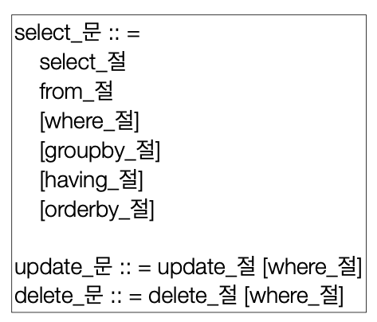

# 객체지향 쿼리 언어

- JPQL
- JPA Criteria
  - JPQL을 작성하는 API, 빌더 클래스 모음
- QueryDSL
  - JPQL을 작성하는 API, 빌더 클래스 모음, 비표준 오픈소스 프레임워크
- 네이티브 SQL 
  - JPA에서 JPQL대신 직접 SQL사용
- JDBC API 직접 사용, MyBatis, SpringJdbcTemplate 함께사용

# JPQL

```java
// 쿼리 생성
String jpql = 
        "select m from Member m where m.age > 18";
List<Member> result = 
        em.createQuery(jpql,Member.class)
        .getResultList();
```
```sql
select
    m.id as id,
    m.age as age,
    m.USERNAME as USERNAME,
    m.TEAM_ID as TEAM_ID
from
    Member m
where
    m.age>18
```

- 가장 단순한 조회 방법
- EntityManger.find()
- 객체 그래프 탐색(a.getB().getC())
- **엔티티 객체**를 조회하는 `객체지향 SQL`
- SQL을 추상화하여 특정 DB에 의존X

# Criteria

`QueryDSL 사용 권장`

```java
//Criteria 사용 준비
CriteriaBuilder cb = em.getCriteriaBuilder();
CriteriaQuery<Member> query = cb.createQuery(Member.class);

//루트 클래스 (조회를 시작할 클래스)
Root<Member> m = query.from(Member.class);

//쿼리 생성 
CriteriaQuery<Member> cq = query.select(m).where(cb.equal(m.get("username"), “kim”));
List<Member> resultList = em.createQuery(cq).getResultList();
```

- 자바코드로 JPQL 작성 가능
  - 컴파일 시점에 오류 발견 가능
  - 동작 쿼리 작성 용이
- JPQL 빌더 역할
- JPA 공식 기능

# QueryDSL

```java
//준비
JPAFactoryQuery query = new JPAQueryFactory(em);
QMember m = QMember.member;

// 쿼리 생성
List<Member> list =
        query.selectFrom(m)
                .where(m.age.gt(18))
                .orderBy(m.name.desc())
                .fetch();
```

- 자바코드로 JPQL 작성 가능
  - 컴파일 시점에 오류 발견 가능
  - 동작 쿼리 작성 편리
- JPQL 빌더 역할

# 네이티브 SQL

```java
String sql = "SELECT ID, AGE, TEAM_ID, NAME FROM MEMBER WHERE NAME = 'kim'";

List<Member> resultList =
   em.createNativeQuery(sql, Member.class).getResultList();
```

- SQL 직접 사용
- 특정 데이터베이스에 의존하는 기능을 사용할 때 사용
  - 오라클의 `CONNECT BY`나 특정 데이터베이스에서만 동작하는 SQL 힌트 등
- 특정 데이터베이스에 의존하는 SQL을 작성해야함
  - 데이터베이스 변경시 수정 필수

# JDBC 직접 사용, SpringJdbcTemplate 등

- JPA와 함께 사용 가능
- **영속성 컨텍스트를 수동 플러시해야함**
  - JPA는 JDBC 커넥션을 획득하는 API 획득X
  - JPA를 우회하는 SQL은 JPA가 인식하지 못함
  - 영속성 컨텍스트와 데이터베이스를 불일치 상태를 만들어 데이터 무결성 훼손 가능
  - 따라서 강제 수동 플러시 후 데이터베이스와 영속성 컨텍스트를 동기화해야함

# JPQL 문법



- 엔티티와 속성은 대소문자 구분 (Member, age)
- JPQL키워드는 대소문자 구분X (SELECT, FROM, where)
- 엔티티 이름 사용, 테이블 이름X
- **별칭 필수**

## 집합과 정렬

```sql
select
    COUNT(m), //회원수
    SUM(m.age), //나이 합
    AVG(m.age), //평균 나이
    MAX(m.age), //최대 나이
    MIN(m.age) //최소 나이
from 
    Member m
```

- GROUP BY, HAVING
- ORDER BY

## TypeQuery, Query

```java
TypedQuery<Member> query =
        em.createQuery("SELECT m FROM Member m", Member.class);

Query query =
        em.createQuery("SELECT m.username, m.age from Member m");
```
- **TypeQuery** : 반환 타입이 명확할 때 사용
- **Query** : 반환 타입이 명확하지 않을 때 사용

## 결과 조회 API

- `query.getResultList()`
    - 결과가 하나 이상일 때 리스트 반환
    - 결과가 없으면 빈 리스트 반환
- `query.getSingleResult()`
    - 결과가 정확하게 하나일때 단일 객체 반환
    - 결과가 없으면 `javax.persistence.NoResultException`
    - 결과가 둘 이상이면 `avax.persistence.NonUniqueResultException`

## 파라미터 바인딩

```java
// 이름 기준
SELECT m FROM Member m where m.username=:username
query.setParameter("username", usernameParam);

// 위치 기준
SELECT m FROM Member m where m.username=?1
query.setParameter(1, usernameParam);
```
- 이름 기준, 위치 기준이 있지만 `이름 기준 사용 권장`

## 프로젝션

- Select절에 조회할 대상을 지정
- 프로젝션 대상
    - 엔티티 : `SELECT m FROM Member m` , `SELECT m.team FROM Member m `
    - 임베디드 타입 : `SELECT m.address FROM Member m`
    - 스칼라 타입 : `SELECT m.username, m.age FROM Member m `
- 여러값 조회
    - Query타입으로 조회
        - casting작업을 따로 해준 후 배열 사용
    - Object[]타입으로 조회
        - 배열값을 지정하여 사용해줘야함
    - **new 명령어로 조회**
        - 단순 값을 DTO로 바로 조회
        - `SELECT new jpabook.jpql.UserDTO(m.username, m.age) FROM
          Member m`
        - 순서와 타입이 일치하는 생성자 필요

## 페이징 API

```java
//페이징 쿼리
String jpql = "select m from Member m order by m.name desc";
List<Member> resultList = 
        em.createQuery(jpql, Member.class)
        .setFirstResult(10)
        .setMaxResults(20)
        .getResultList();
```

- `setFirstResult(int startPosition)` : 조회 시작 위치(0부터 시작)
- `setMaxResults(int maxResult)` : 조회할 데이터 수

## 조인

- 내부 조인 : `SELECT m FROM Member m [INNER] JOIN m.team t`
- 외부 조인 : `SELECT m FROM Member m LEFT [OUTER] JOIN m.team t`
- 세타 조인(카다시안 조인) : `select count(m) from Member m, Team t where m.username
  = t.name`
- on절
    - 조인 대상 필터링
        - 회원과 팀을 조인하면서 팀 이름이 A인 팀만 조인
      ```sql
      -- JPQL
      SELECT m, t FROM Member m LEFT JOIN m.team t on t.name = 'A'
      
      -- SQL
      SELECT m.*, t.* FROM
      Member m LEFT JOIN Team t ON m.TEAM_ID=t.id and t.name='A'
      ```
    - 연관관계 없는 엔티티 외부 조인
        - 회원의 이름과 팀의 이름이 같은 대상 외부 조인
      ```sql
      -- JPQL
      SELECT m, t FROM
      Member m LEFT JOIN Team t on m.username = t.name
      --SQL
      SELECT m.*, t.* FROM
      Member m LEFT JOIN Team t ON m.username = t.name
      ```

## 서브 쿼리 지원 함수

- `[NOT] EXISTS` : 서브쿼리에 결과가 존재하면 참
- `ALL` : 모두 만족하면 참
- `{ANY | SOME}` : 조건을 하나라도 만족하면 참
- `[NOT] IN` : 서브쿼리의 결과 중 하나라도 같은 것이 있으면 참
- 한계
    - JPA는 WHERE, HAVING, SELECT에서만 서브 쿼리 가능
    - FROM절에서 불가능(하이버네이트6부터는 가능)