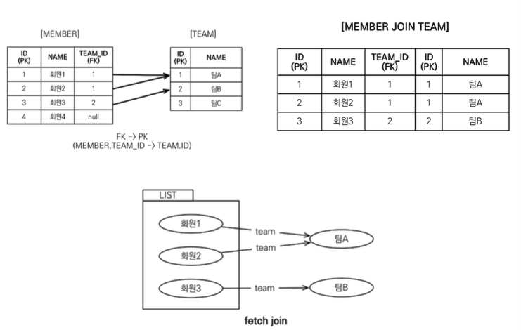
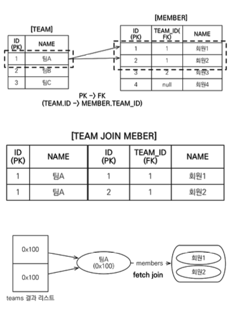
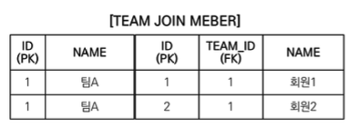

# 경로 표현식

```java
select
    m.username // 상태 필드
from 
    Member m
join 
    m.team t // 단일 값 연관 필드
join 
    m.orders o // 컬렉션 값 연관 필드
where 
    t.name = '팀A'
```

- .(점)을 찍어 객체 그래프를 탐색하는 것
- 상태필드
- 연관필드
    - 단일 값 연관필드
    - 컬렉션 값 연관필

# 상태필드  
```sql
-- JPQL
select m.username, m.age from Member m

-- SQL
select m.username, m.age from Member m
```

- 단순히 값을 저장하기 위한 필드 (m.username)
- 경로 탐색의 끝, 탐색X

# 연관필드 

- 연관관계를 위한 필드

## 단일 값 연관필드 

```sql
-- JPQL
select o.member from Order o -- 묵시적 내부 조인

-- SQL
select 
    m.*
from 
    Orders o
inner join 
        Member m 
        on 
            o.member_id = m.id
```
- `@ManyToOne`, `@OneToOne`, 대상이 엔티티 (m.team)
- 묵시적 내부 조인 발생, 탐색O

## 컬렉션 값 연관필드

- `ß@OneToMany`, `@ManyToMany`, 대상이 컬렉션 (m.orders)
- 묵시적 내부 조인 발생, 탐색X
  - `From절에서 명시적 조인을 통해 별칭을 얻으면 별칭을 통해 탐색 가능`

# 명시적 조인, 묵시적 조인

- **명시적 조인** : join 키워드 직접 사용
  - `select m from Member m join m.team t`
- **묵시적 조인** : 경로 표현식에 의해 묵시적으로 SQL 조인 발생(내부조인만 가능)
  - `select m.team from Member m`

## 경로탐색을 사용한 묵시적 조인시 주의 사항

```sql
select 
    o.member.team
from 
    Order o  -- 성공

select 
    t.members 
from 
    Team -- 성공

select 
    t.members.username 
from 
    Team t -- 실패
        
select 
    m.username 
from 
    Team t 
    join t.members m -- 성공
```

- 항상 내부 조인
- 컬렉션은 경로 탐색의 끝, 탐색을 진행하기 위해서는 명시적 조인을 통해 별칭을 얻어야함
- 경로 탐색은 주로 SELECT, WHERE절에서 사용하지만 묵시적 조인으로 인해 SQL의 FROM(JOIN)절에 영향을 줌
`묵시적 조인 대신에 명시적 조인 사용!`
- 조인은 SQL 튜닝에 중요 포인트
- 묵시적 조인 사용 시 조인이 일어나는 상황을 한눈에 파악하기 어려움

# JPQL - 페치 조인(fetch join)

- SQL에서 사용하지 않음, JPQL에서 성능 최적화를 위해 제공하는 기능
- 엔티티에 직접 적용하는 글로벌 로딩 전략(@OneToMany(fetch = FetchType.LAZY))보다 우선 적용
- 연관된 엔티티나 컬렉션을 한번에 같이 조회하는 기능
- 객체 그래프를 유지할때 사용하면 효과적
- 여러테이블을 조인해서 새로운 결과를 내야할 경우 일반 조인을 사용하여 새로운 DTO에 담아 반환하는 것이 효과적
- `join fetch` 명령어로 사용가능
- [LEFT [OUTER] | INNNER] JOIN FETCH 조인 경로

## 엔티티 페치 조인



```sql
-- JPQL
select m from Member m join fetch m.team

--SQL
SELECT 
    M.*, T.* 
FROM 
    MEMBER M
    INNER JOIN TEAM T 
            ON M.TEAM_ID=T.ID
```

- 회원을 조회하면서 연관된 팀도 함께 조회(SQL 한 번에)
- N:1의 관계일 경우 컬럼수 늘어나지 않음

## 컬렉션 페치 조인



```sql
-- JPQL
select 
    t
from 
    Team t 
    join fetch t.members
where 
    t.name = '팀A'

-- SQL
SELECT 
    T.*, M.*
FROM 
    TEAM T
    INNER JOIN MEMBER M 
    ON T.ID=M.TEAM_ID
WHERE 
    T.NAME = '팀A'
```

- 1:N관계인 경우 컬럼수가 늘어남

### 페치 조인과 DISTINCT

- **SQL의 DISTINCT** : 중복된 결과 제거
  -  
  - 데이터가 다르므로 중복제거가 되지 않음
- **JPQL의 DISTINCT** : SQL의 DISTINCT + 어플리케이션에서 엔티티 중복 제거
  - 같은 식별자를 가진 TEAM엔티티 제거
>하이버네이트6 이후 DISTINCT 명령어르 사용하지 않아도 자동 중복 제거

### 페치 조인과 일반 조인의 차이

#### 일반 조인
```sql
-- JPQL
select 
    t
from 
    Team t 
    join t.members m
where 
    t.name = '팀A'

-- sql
SELECT
    T.*
FROM 
    TEAM T
    INNER JOIN MEMBER M 
    ON T.ID=M.TEAM_ID
WHERE 
    T.NAME = '팀A*'
```

- JPQL은 결과 반환시 연관관계 고려X (지연 로딩)
- SELECT에 명시한 엔티티만 조회함
- TEAM엔티티만 조회해오고 연관관계인 MEMBER컬렉션 조회X

#### 페치조인

```sql
-- JPQL
select 
    t
from 
    Team t 
    join fetch t.members
where 
    t.name = '팀A'

-- SQL
SELECT
    T.*, M.*
FROM TEAM T
     INNER JOIN MEMBER M 
     ON T.ID=M.TEAM_ID
WHERE 
    T.NAME = '팀A*'
```

- FETCH JOIN 사용시 TEAM과 연관관계인 MEMBER도 함께 조회(지연로딩X)
- 한계
  - 페치 조인 대상에는 별칭X
    - 별칭을 잘못사용시 연관된 데이터 수가 달라서 데이터 무결성이 깨질 수 있음
  - 둘 이상의 컬렉션은 페치 조인 불가
    - 컬렉션 * 컬렉션으로 카테시안 곱이 만들어짐
  - 컬렉션을 페치 조인할 경우 페이징API 사용불가
    - 경고 로그를 남기면서 메모리에서 페이징 처리
    - 데이터가 많을 경우 성능 이슈와 메모리 초과 예외 발생 가능

# Named 쿼리 : 정적 쿼리

```java
@Entity
@NamedQuery(
	name = "Member.findByUsername",
	query = "select m from Member m where m.username = :username")
public class Member {
	...
}

List<Member> resultList = em.createNamedQuery("Member.findByUsername", Member.class)
        .setParameter("username", "회원1")
        .getResultList();
```
- 미리 정의한 쿼리에 명명하여 사용하는 쿼리
- 어플리케이션 로딩 시점에 초기화 후 재사용
- 어플리케이션 로딩 시점에 쿼리를 검증

# 벌크 연산

```java
int resultcount = em.createQuery("update Member m set m.age = 20")
    .executeUpdate();
```

- 한번에 여러 데이터를 수정/삭제 가능
- `executeUpdate()`사용
- 벌크 연산으로 영향받은 엔티티의 건수 반환

### 주의점

- 벌크 연산 사용시 DB에 데이터가 바로 반영됨
- 영속성 컨텍스트에 수정된 엔티티가 있을 수 있으니 flush해서 반영 후 벌크 연산 사용 
- 해결 방안
  - 벌크 연산 먼저 실행
  - 벌크 연산 수행후 영속성 컨텍스트 초기화